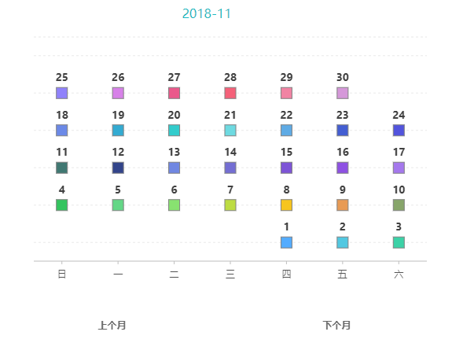

# datepicker

## 项目编写

[项目编写的具体过程](./doc/datepicker.md)

## 项目重构

[核心逻辑的提炼,进行mvc分离](./doc/rebuild.md)

[使用G2重构](./doc/rebuildInG2.md) **new**

## 用法

1. 在HTML文件中引入[main.css](./src/main.css),[data.js](./src/data.js)和[main.js](./src/main.js)

```html
        <link rel="stylesheet" type="text/css" href="main.css">
        <script src="data.js"></script>
        <script src="main.js"></script>
```

2.  初始化datepicker

```js
        <script>
            datepicker.init('.datepicker');
        </script>
```

1. 挂载datepicker

     ```<input type="text" name="" value="" class="datepicker">```

## 效果

