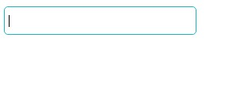
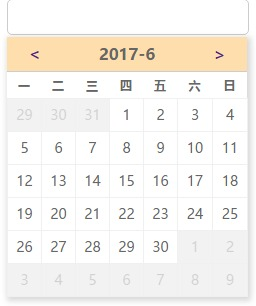

# datepicker

### 用法

1. 在HTML文件中引入[mian.css](./src/mian.css),[data.js](./src/data.js)和[mian.js](./src/mian.js)

        <link rel="stylesheet" type="text/css" href="mian.css">
        <script src="data.js"></script>
        <script src="mian.js"></script>

2.  初始化datepicker
    
        <script>
            datepicker.init('.datepicker');
        </script>

3. 挂载datepicker

     ```<input type="text" name="" value="" class="datepicker">```

### 效果

1. 点击输入框之前



2. 点击输入框之后


3.切换月份

