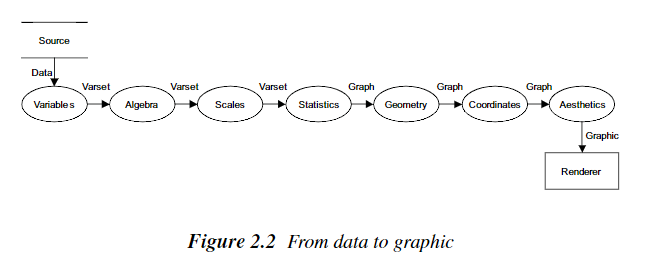
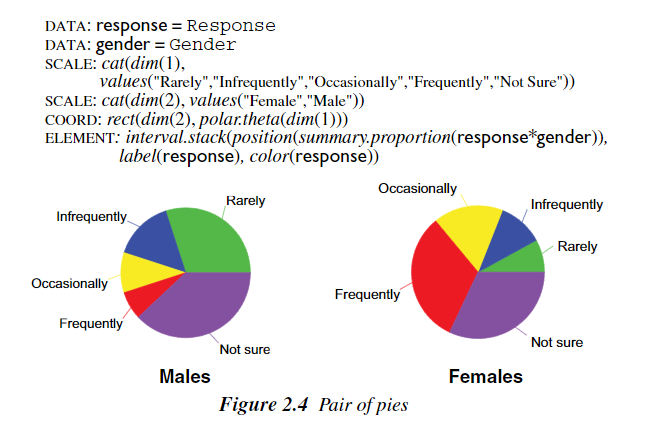

# 使用G2重构日历

## G2是什么

> [G2](https://antv.alipay.com/zh-cn/g2/3.x/tutorial/index.html)是一套基于可视化编码的图形语法，以数据驱动，具有高度的易用性和扩展性，用户无需关注各种繁琐的实现细节，一条语句即可构建出各种各样的可交互的统计图表。

简单来说G2就是一个可视化JavaScript工具库，把传进去的数据用图表表现出来，但是不同于其他图形库，G2是基于图形语法工作的

## 图形语法

图形语法描述了我们从数据到图表的映射



1. 从数据创建变量 data -> variables[set]
2. 对变量集进行运算,相对比与集合的运算,找到感兴趣的研究变量(cross, blend, nest)
3. 对要研究的变量进行归一化，定义变量的性质(cat, time)
4. 对复杂的变量进行统计,并不是所有的变量都要进行统计
5. 创建几何图形 variable -> graph
6. 将建立的图形放到坐标系
7. 对数据进行美学优化(color, point, label)
8. 得到相应图形

下面给一个简单的示例：



## 重构的简单说明

数据还是来源于**data.js**，计算方法大致相同，只不过返回的数据有所不同，日历作为一个二维的图表，返回如下数据：

```js
    ret.push({
        weekDay: weekDay,
        weekIndex: weekIndex,
        date: showDate,
    });
```

横坐标是weekDay，纵坐标是weekIndex，值是date，则有如下图形语法公式：

```js
    chart
        .point()
        .shape("square")
        .position("weekDay*weekIndex")
        .color("date")
```

添加两个辅助元素对事件的监听，用ID进行区分，来切换上下月：

```js
    chart.on("guide-text:click", ev => {
        if (ev.appendInfo.id == "prevMonth") {
            // some code
        } else if (ev.appendInfo.id == "nextMonth") {
            // some code
        }
    });
```