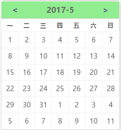
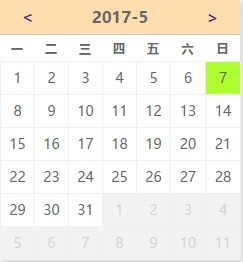

# 日历插件的制作

1. 静态页面的编写

首先要编写一个合理的静态页面，结构要清晰，变量定义实行语义化，实现组件化的思想

插件分为两个部分，一个表头，一个表体

    

    ...表头内容 
    

    

    ...表体内容
    

2. CSS样式的渲染

合理的采用特定样式，掌握常见的元素的样式的编写，对于特殊的要给予记忆.
    
box-shadow,border,padding 要灵活的运用
掌握快速布局的方法，一定要能快速的编写样式

3. 数据的获取

怎样去获取一个合理的数据，怎样去处理一个数据，合理的去封装一个数据结构

**在处理年月的时候，如何获取正确格式**

注意到月份的范围是0-11，星期是0-6，当数据越界的时候要实行重置

    myDate.getMonth();       //获取当前月份(0-11,0代表1月)
    myDate.getDate();        //获取当前日(1-31)
    myDate.getDay();         //获取当前星期X(0-6,0代表星期天)
        
    var firstDay = new Date(year, month - 1, 1);
    var firstDayWeekDay = firstDay.getDay();
    if (firstDayWeekDay === 0) firstDayWeekDay = 7;
    //获取一个月的第一天

    var lastDayOfLastMonth = new Date(year, month - 1, 0);
    var lastDateOfLastMonth = lastDayOfLastMonth.getDate();
    //前一月的最后一天

返回数据

    return {
            year:year,
            month:month,
            days:ret,
            /*ret为一个月的数据*/
        }
暴露变量

     window.datepicker = datepicker//暴露一个全局变量，数据是全局变量的一个属性

4. 数据的调用与渲染

需要把相应的数据插入到合理的结构中，注意数据的实时性

结构函数

    datepicker.buildUI = function (year, month){
        ...编写结构
    }

渲染函数

     datepicker.render = function (direction) {
         ...把得到的结构渲染出来
        var html = datepicker.buildUI(year, month);
        $wrapper = document.querySelector('.ul-datepicker-wrapper')
        if (!$wrapper) {
            $wrapper = document.createElement('div');
            $wrapper.className = 'ul-datepicker-wrapper';
        }
        $wrapper.innerHTML = html;

        document.body.appendChild($wrapper);
     }

功能函数

    datepicker.init = function (input) {
           ...实现一定的功能
            datepicker.render();
            //调渲染

        $input.addEventListener('click', function () {
                ...监控输入框，实现日历的隐藏与显示
        },false)

        $wrapper.addEventListener('click', function (e) {
            ...监控切换月份按钮，实现月份的切换和渲染
        }
        ,false)

        $wrapper.addEventListener('click', function (e) {
            ...监控日期，并获取值传入输入框
        },false)
        
    }

5. 分析与改进

* 可以在界面结构上进行精简
* 显示今日
* 显示当月

6. 结果展示

7. 改进和问题

改进
* 显示今日已修复
* 显示当月已修复

      datepicker.show = function() {
        for (var i=0;i<$td.length;i++){
            //显示今日
            if(monthData.year === year && monthData.days[i].month === month && monthData.days[i].date === date) {
                $td[i].classList.add('ul-datepicker-today-show')
            }
            // 显示当月
            if(monthData.days[i].month !== monthData.month) {
                $td[i].classList.add('ul-datepicker-month-show');

                $td[i].addEventListener('click',function(){
                    datepicker.render('next');//渲染数据没有错，但是与输入框期望值相差一个月
                },false)
            }
        }
      }

结果

